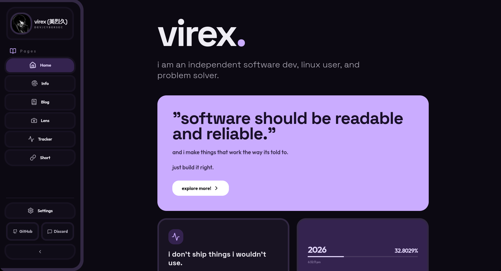
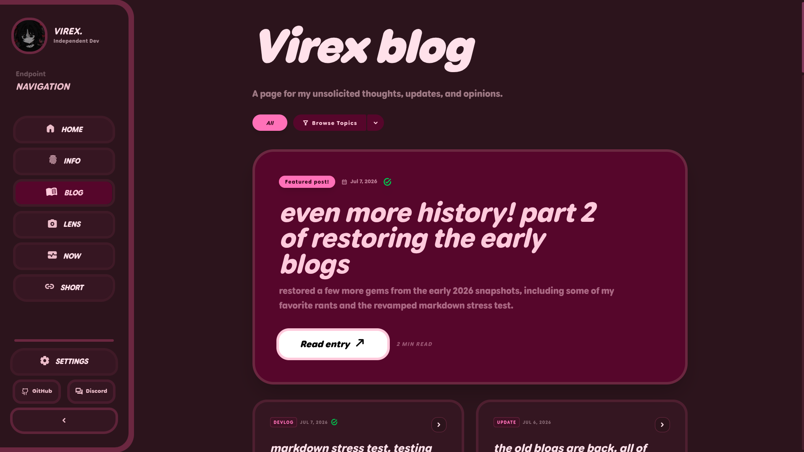
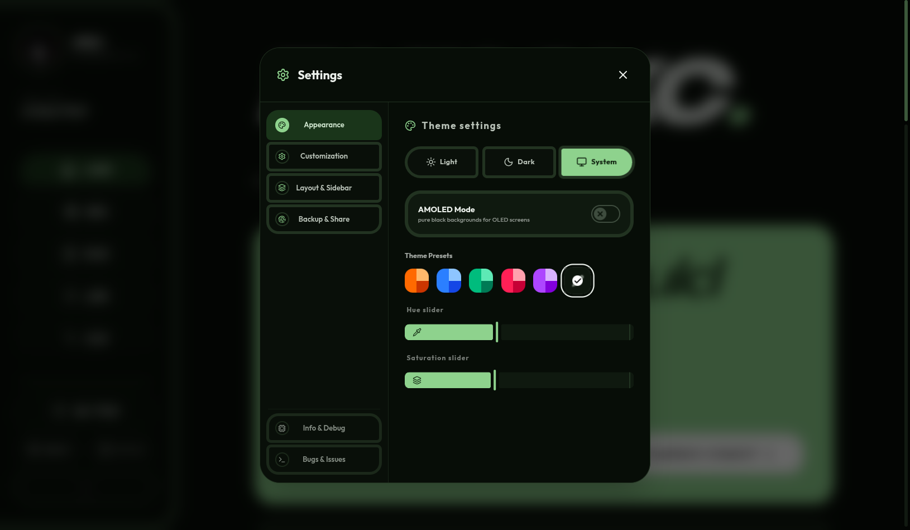
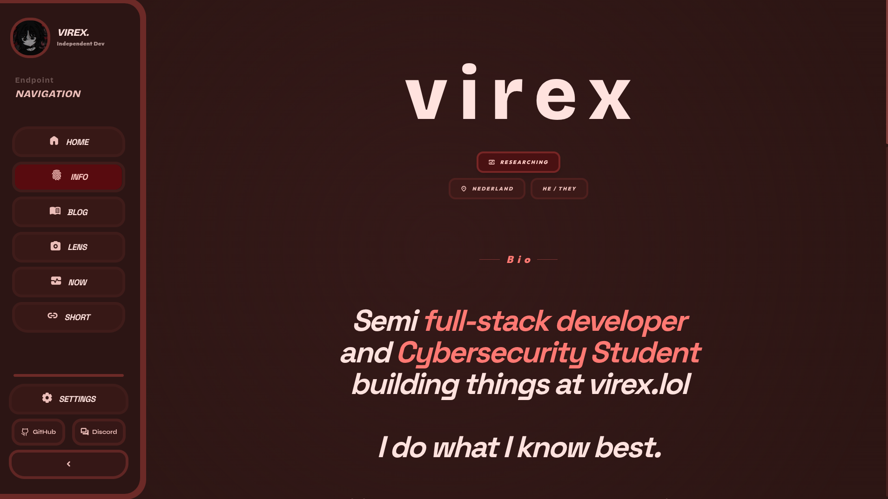
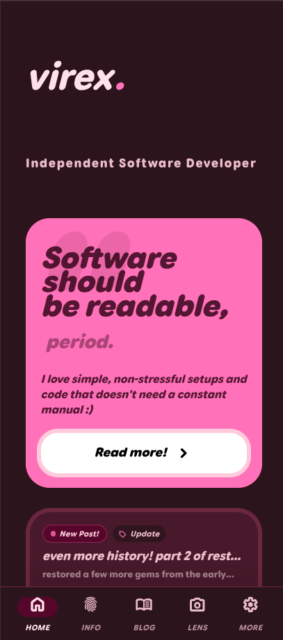
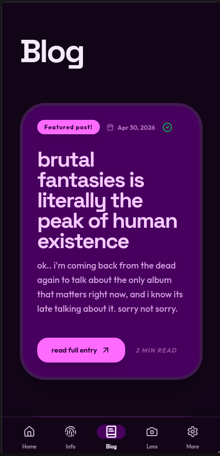
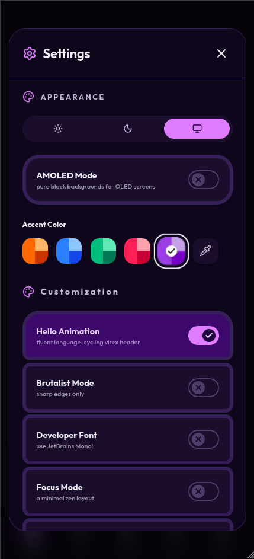
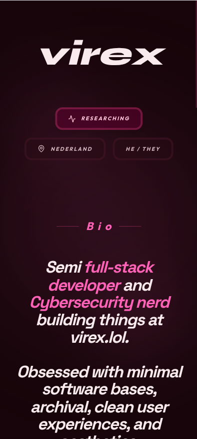

<div align="center">


# [virex.lol](https://virex.lol)

personal hub and experimental site. material 3 ui, custom android-like shell, built on react 19. research, photography, rants.

</div>
---
## what's new

- moved to cloudflare - bye vercel!

> last updated: may 25, 2026 — [full changelog](https://github.com/hnpf/virex.lol/commits/main)
---

## screenshots

**desktop**
<table>
  <tr>
    <td></td>
    <td></td>
    <td></td>
    <td></td>
  </tr>
  <tr>
    <td align="center"><sub>home</sub></td>
    <td align="center"><sub>blog</sub></td>
    <td align="center"><sub>settings</sub></td>
    <td align="center"><sub>readme</sub></td>
  </tr>
</table>

**mobile**
<table>
  <tr>
    <td></td>
    <td></td>
    <td></td>
    <td></td>
  </tr>
  <tr>
    <td align="center"><sub>home</sub></td>
    <td align="center"><sub>blog</sub></td>
    <td align="center"><sub>settings</sub></td>
    <td align="center"><sub>readme</sub></td>
  </tr>
</table>

---

## stack

| layer | tech |
|---|---|
| front | react 19 + vite 6, tailwind 4, motion (liquid physics), lucide |
| back | express on vercel, sqlite via `better-sqlite3` |
| assets | webp via `sharp`, custom noise engine |

---

## features

> **lens** — bento-grid photo gallery. swipe/drag, keyboard nav, high-refresh animations. assets compressed ~200mb → ~40mb.

> **blog** — linux, e-waste, dev rants. read-tracking + rss at `/rss.xml` (actually updated now. no really.)

> **virex shorten** — url shortener at `/r/:slug`. sqlite-backed, dash-managed, route shadow protection included.

> **lore** — interactive bio with a cool ass animation and more.

> **tracker** — research log. cybersec, dev, design, tooling, whatever i'm poking at.

> **settings** — accent hue, light/dark/system, highHz mode, brutalist mode (0px radii), zen mode, jetbrains mono override, and more.

---

## getting started

```bash
# clone + install
git clone https://github.com/hnpf/virex.lol
cd virex.lol
npm install        # or pnpm install

# dev
npm run dev        # vite + local api server

# prod
npm run build      # output to dist/
```

> you'll need node 18+ and a sqlite-compatible env for the api routes. vercel handles this automatically on deploy.

---

## layout

```
api/
  index.ts              express handlers (shortener, rss, etc.)
  db.ts                 sqlite read/write logic

public/
  photography/          webp archive (compressed via sharp)
  robots.txt
  rss.xml
  sitemap.xml

src/
  App.tsx               router + top-level page logic
  Dash.tsx              shortener dashboard
  constants.ts          data source (bio, links, projects, etc.)
  ThemeContext.tsx       accent / mode / settings state (context api)
  M3Slider.tsx          material 3 slider component
  M3Switch.tsx          material 3 toggle switch
  CopyLinkCapsule.tsx   clipboard copy ui
  NotFound.tsx          404 page
  No.tsx                no
  index.css
  main.tsx
```

---

## todo

- [x] settings: import/export config as json [Added!! has way more than just json (includes link sharing and more!)]
- [ ] honey-pot router (unsure)
- [ ] rss/atom deep-linking & webmention skeleton
- [ ] quick settings android-like drag-down notification shade
- [ ] dynamic material 3 source color extraction
- [ ] snapping & workspace tiling mode for custom panels
- [ ] lazy-loading blurred placeholder matrix for lens

---

<div align="center">

[virex.lol](https://virex.lol) · [github.com/hnpf](https://github.com/hnpf) · gpl-3.0

</div>
